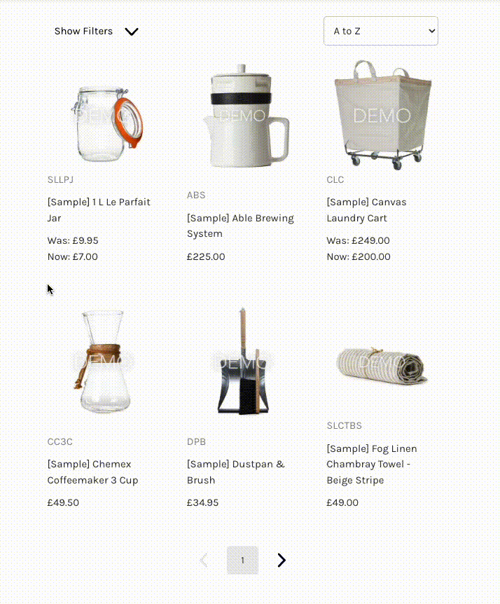

# Commerce Blocks - Space48

<div align="right">

</div>

Made during the BigCommerce [#BigHackathon: Summer 22](https://bighackathonsummer22.splashthat.com/), Commerce Blocks is
an App that lets you create grids or carousels of products to showcase on any website.

Why not checkout the demos on our [website](https://www.space48.com/blog-bigcommerce-apps/introducing-commerce-blocks/) or our BigCommerce [store blog](https://demo.space48apps.com/blog/new-product-release/).


## Features

- Choose between a grid or carousel layout
- Show search, categories and filters
- Sort by a-z, price, best selling, relevance etc
- Select individual products, categories or specify a search term

## Instructions

1. Install the app on your bigcommerce store
2. Add a new block and configure your product options
3. Copy the provided snippet and paste it into your website
4. See the results

## Future Plans

 - Built in checkout so users don't have to navigate to your BigCommerce store
 - Improved quick view with product options and quantity fields
 - Addition layout and product configuration options

## Developer Guide

This app was built using the new BigCommerce Laravel/React starter kit, available [here](https://github.com/Space48/bigcommerce-laravel-react-starter-app).

To get the app running locally, clone the repo and run:

`composer install`

`npm install`

Create a .env file by copying the env.example and amending for your local environment setup.

If using Laravel Sail then use `sail artisan` instead of `php artisan` going forward, and run:

`./vendor/bin/sail up`

Then:

`php artisan migrate`

`npm run dev`

Next, if you haven’t already, create an app on your Bigcommerce developer account. You’ll need to populate the following fields under the technical tab, to match your local development domain.

- Auth Callback URL: **https://your-local-domain.com/bc/install**
- Load Callback URL: **https://your-local-domain.com/bc/load**
- Uninstall Callback URL: **https://your-local-domain.com/api/bc/uninstall**
- Remove User Callback URL: **https://your-local-domain.com/api/bc/remove-user**

You’ll also need to set the following OAuth scopes:

- Information & Settings: **READ-ONLY**
- Products: **READ-ONLY** _(this can be removed later, if it’s not required)_


Once the app has been saved, copy the following details into the .env file:

```
BIGCOMMERCE_APP_ID=<shown in the URL when editing your app>
BIGCOMMERCE_CLIENT_ID=<shown via View Client ID>
BIGCOMMERCE_CLIENT_SECRET=<shown via View Client ID>
BIGCOMMERCE_WEBHOOK_SECRET=<Generate a unique code for this>
```

You’re now ready to install the app on your store.

### Jobs

The database is used to manage the job queue. 

Run the workers with:

```
php artisan queue:work high,low
```

### Testing

Tests can be ran via:

`php artisan test`


### Contributing

Pull requests are welcome. For major changes, please open an issue first to discuss what you would like to change.

## License

[BSD-4-Clause]()
